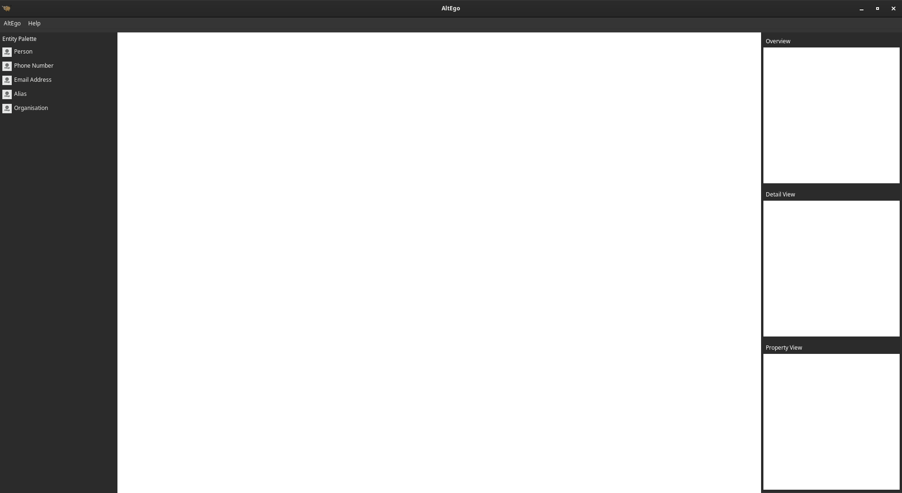

# AltEgo

A Free/Libre Maltego replacement, written in python and TKinter.

## Features

- CaseFile like GUI interface
- Transforms (get data about a Entity from various data sources) [PLANNED]
- CLI Version (comes with a CLI interface to make automation easier) [PLANNED]

## Screenshots



## Running in Dev Mode
You can install this program by grabbing the source code and running `pip install .` inside the project root.

```bash
# Download
git clone https://github.com/JamesClarke7283/AltEgo.git
cd AltEgo
# Make a virtual environment
python3 -m venv .venv
# Enter environment
source .venv/bin/activate
# Install Dependencies
pip3 install briefcase
# Run
briefcase dev

# Or to install
briefcase package
# Then look in the ./dist directory, the package/executable for your platform will be in that folder.
```

## Build docs
```bash
cd docs/sphinx
make html
# Now open the index.html in the ./docs/sphinx/build/html directory.
```

## Licensing

### Software License

This program is free software: you can redistribute it and/or modify it under the terms of the GNU General Public License as published by the Free Software Foundation, either version 3 of the License, or (at your option) any later version.

This program is distributed in the hope that it will be useful, but WITHOUT ANY WARRANTY; without even the implied warranty of MERCHANTABILITY or FITNESS FOR A PARTICULAR PURPOSE. See the GNU General Public License for more details.

You should have received a copy of the GNU General Public License along with this program at [LICENSE.md](./LICENSE.md). If not, see <https://www.gnu.org/licenses/>. 

### Documentation License

The documentation for this program is licensed under the [GNU Free Documentation License](https://www.gnu.org/licenses/fdl-1.3.en.html) 1.3 or any later version published by the Free Software Foundation. You can find a copy of it in [docs/LICENSE.md](/docs/LICENSE.md)

### Assets License

All assets in the `./src/altego/resources` directory are licensed under the [Attribution-ShareAlike 4.0 International (CC BY-SA 4.0)](https://creativecommons.org/licenses/by-sa/4.0/) license. You can view the full text of the license in the [LICENSE](./src/altego/resources/LICENSE) file located in the `./src/altego/resources` directory.

### License Exceptions

If you need to use AltEgo under different licensing terms than the GPLv3-or-later, you can contact me to negotiate a commercial license. Licensing exceptions are available for a fee.

To discuss licensing exceptions and fee arrangements, please contact:

**James Clarke**  
Email: [james@jamesdavidclarke.com](mailto:james@jamesdavidclarke.com)

I will be happy to discuss your specific needs and how we can accommodate them under a different license.