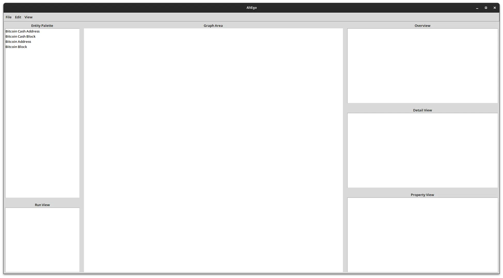

Introduction
============

AltEgo is a Free/Libre Maltego replacement, written in Python and TKinter.

Features
--------

- CaseFile like GUI interface
- Transforms (get data about an Entity from various data sources) [PLANNED]
- CLI Version (comes with a CLI interface to make automation easier) [PLANNED]

Screenshots
-----------

